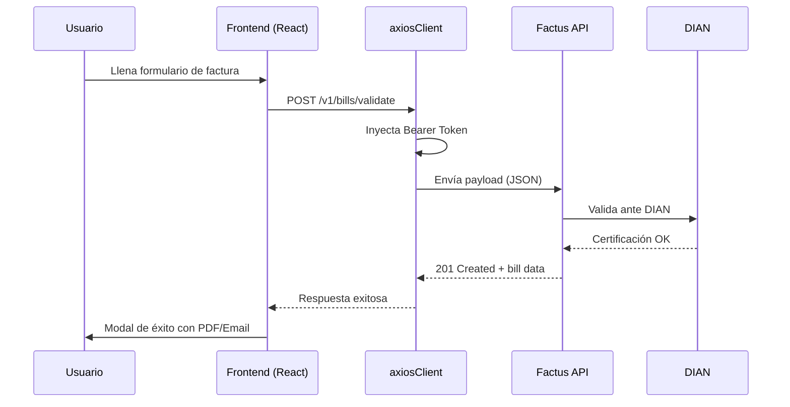

# Factus Nova 🚀

> **Sistema Enterprise de Facturación Electrónica para Colombia**

Factus Nova es una plataforma de facturación electrónica de alta calidad, integrada con la API de **Factus** y certificada ante la **DIAN**. Diseñada con estándares profesionales de UI/UX y una arquitectura limpia que separa claramente las responsabilidades del sistema.

---

## 📸 Capturas de Pantalla

### Panel de Control
Dashboard interactivo con métricas en tiempo real, accesos rápidos y resumen de actividad.

### Facturación Electrónica
Formulario de emisión con validación en tiempo real, selector de municipios DANE, y modal de éxito con descarga de PDF.

### Gestión de Clientes
Vista completa de clientes registrados con búsqueda y filtros.

---

## ⚡ Funcionalidades Principales

| Módulo | Descripción |
|--------|------------|
| 🔐 **Autenticación** | Login con OAuth 2.0 + auto-refresh de token cuando expira |
| 📊 **Dashboard** | Métricas en tiempo real, facturas recientes, accesos rápidos |
| 🧾 **Facturación Electrónica** | Emisión, validación DIAN, descarga PDF, envío por correo |
| 👥 **Gestión de Clientes** | CRUD completo de clientes vía API Factus |
| 📦 **Productos** | Catálogo de productos con precios y códigos |
| 📋 **Notas Crédito** | Listado y gestión de notas crédito |

---

## 🏗️ Arquitectura del Proyecto

```
src/
├── domain/                    # Capa de Dominio (Entidades y Reglas de Negocio)
│   ├── entities/
│   │   ├── Customer.js        # Entidad Cliente
│   │   ├── Invoice.js         # Entidad Factura
│   │   └── Product.js         # Entidad Producto
│   └── mappers/
│       └── InvoiceMapper.js   # Mapeo Formulario → Payload Factus API
│
├── application/               # Capa de Aplicación (Casos de Uso)
│   ├── ports/
│   │   └── IAuthService.js    # Interfaz de autenticación
│   └── services/
│       ├── InvoiceService.js  # Servicio orquestador de facturas
│       └── MetadataService.js # Servicio de metadata/configuración
│
├── infrastructure/            # Capa de Infraestructura (Implementaciones)
│   ├── http/
│   │   └── axiosClient.js     # Cliente HTTP con interceptores y auto-refresh token
│   ├── repositories/
│   │   ├── AuthRepository.js          # Autenticación OAuth 2.0
│   │   ├── CustomerRepository.js      # CRUD Clientes vía API
│   │   ├── InvoiceRepository.js       # Emisión de facturas (orquestador)
│   │   ├── LocalInvoiceRepository.js  # Almacenamiento local
│   │   └── NumberingRangeRepository.js # Rangos de numeración DIAN
│   └── services/
│       └── FactusAuthService.js       # Implementación auth Factus
│
└── presentation/              # Capa de Presentación (React)
    ├── App.jsx                # Router principal
    ├── main.jsx               # Entry point
    ├── styles/
    │   └── index.css          # Design system Nova UI completo
    └── components/
        ├── Login.jsx          # Página de autenticación
        ├── Layout.jsx         # Layout principal (sidebar + contenido)
        ├── Navbar.jsx         # Barra de navegación superior
        ├── Dashboard.jsx      # Panel de control con métricas
        ├── InvoiceForm.jsx    # Formulario de emisión de facturas
        ├── CustomerForm.jsx   # Gestión de clientes
        ├── ProductsView.jsx   # Vista de productos
        └── CreditNotesView.jsx # Vista de notas crédito
```

---

## 🛠️ Stack Tecnológico

| Tecnología | Uso |
|-----------|-----|
| **React 19** | Framework de UI |
| **Vite** | Build tool y dev server |
| **Vanilla CSS** | Design system Nova UI (tokens, variables, componentes) |
| **Axios** | Cliente HTTP con interceptores |
| **React Hook Form** | Gestión de formularios |
| **Lucide React** | Iconografía |
| **Factus API** | Integración de facturación electrónica DIAN |

---

## 🚀 Instalación y Ejecución

### Prerrequisitos
- Node.js 18+
- Cuenta en Factus (ambiente Sandbox o Producción)

### 1. Clonar el repositorio
```bash
git clone https://github.com/ferdinando04/Reto_factus.git
cd Reto_factus
```

### 2. Instalar dependencias
```bash
npm install
```

### 3. Configurar variables de entorno
Crear archivo `.env` basado en `.env.example`:
```env
VITE_FACTUS_CLIENT_ID=tu_client_id
VITE_FACTUS_CLIENT_SECRET=tu_client_secret
VITE_FACTUS_EMAIL=tu_email@factus.com
VITE_FACTUS_PASSWORD=tu_password
```

### 4. Ejecutar en desarrollo
```bash
npm run dev
```
La aplicación se abrirá en `http://localhost:3000`

---

## 🧪 Flujo de Facturación



### Proceso detallado:
1. **Autenticación** → OAuth 2.0 con auto-refresh de token
2. **Obtención de Rangos** → `GET /v1/numbering-ranges` filtrando por "Factura de Venta"
3. **Mapeo de Datos** → `InvoiceMapper` transforma formulario → payload API
4. **Emisión** → `POST /v1/bills/validate` envía a DIAN
5. **Post-emisión** → Descarga PDF, envío por correo, ver en portal

---

## 🎨 Design System — Nova UI

El sistema de diseño está inspirado en interfaces de SaaS enterprise modernos:

- **Paleta:** Naranja Factus (#FF6C37) + neutrales profesionales
- **Tipografía:** Inter (Google Fonts)
- **Componentes:** Cards, inputs, badges, modales, botones con estados
- **Responsive:** Mobile-first, verificado en 375px hasta 1920px
- **Animaciones:** Transiciones suaves con `animate-fade-in`

---

## 📋 Municipios Soportados

El formulario incluye un selector dropdown con los municipios principales de Colombia (IDs de Factus API):

| Ciudad | ID Factus |
|--------|----------|
| Bogotá D.C. | 169 |
| Medellín | 80 |
| Cali | 1079 |
| Barranquilla | 88 |
| Cartagena | 318 |
| Bucaramanga | 238 |
| Pereira | 885 |
| Manizales | 622 |
| Ibagué | 448 |
| Pasto | 792 |
| Villavicencio | 1061 |

---

## 🔒 Seguridad

- Token almacenado en `sessionStorage` (se limpia al cerrar pestaña)
- Auto-refresh automático cuando el token expira (401)
- Credenciales de API en `.env` (no incluidas en el repositorio)
- Proxy de Vite para evitar CORS en desarrollo

---

## 📝 Notas del Sandbox

- **Correo:** El envío de correo no está disponible en el ambiente sandbox de Factus
- **PDF:** Se puede descargar directamente desde el portal de Factus
- **Rangos:** El rango de numeración para facturas usa el prefijo SETP en sandbox

---

## 👤 Autor

**Fernando Vega**
- GitHub: [@ferdinando04](https://github.com/ferdinando04)
- Email: fernando041581@gmail.com

---

*Proyecto desarrollado como reto técnico de Facturación Electrónica — Factus 2026*
